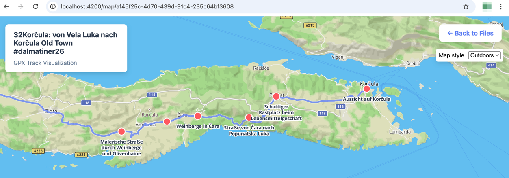

# MapStash

A Spring Boot application for storing and visualizing GPX (GPS Exchange Format) files on interactive maps using Mapbox GL JS.

## Quick cheat sheet (most-used commands)

### Development
- make run
- mvn spring-boot:run -Dspring-boot.run.profiles=local

### Build
- make build              # full build with tests
- make build-skip-tests   # build without tests
- make jar                # alias for build

### Run artifact
- java -jar target/mapstash-0.1.0-SNAPSHOT.jar

### GraalVM native build (short)
- export JAVA_HOME=/path/to/graalvm
- mvn clean package -Pnative -DskipTests
- ./target/mapstash

### Tests
- mvn test
- mvn test -Dtest=GpxServiceTest
- mvn test -Dtest=GpxServiceTest#testConvertToGeoJson

### Quick debug
- pg_isready
- echo $MAPBOX_TOKEN
- curl -s http://localhost:4200/api/gpx/{fileId}

## Features

- Upload GPX files (drag-and-drop)
- Interactive maps (Mapbox GL JS)
- Track, route and waypoint display
- File metadata persisted in PostgreSQL (with PostGIS)
- Server-side rendering with Thymeleaf for fast page loads

## Technology stack (guidance)

- Backend: Spring Boot (4.x compatible; Java 25 recommended for modern builds)
- Database: PostgreSQL + PostGIS
- Build: Maven (use system mvn; SDKMAN recommended for GraalVM JDKs)
- Templates: Thymeleaf (server-side)
- Map rendering: Mapbox GL JS (loaded from CDN in templates)
- GPX parsing: io.jenetics:jpx
- Data format: GeoJSON
- CI: GitHub Actions

## Prerequisites

- Java 25+ (recommended) — SDKMAN is recommended for managing GraalVM JDKs
- Maven 3.6+
- PostgreSQL 12+ (with PostGIS)
- Mapbox access token (create a free token at https://account.mapbox.com/access-tokens/)
- For native builds: GraalVM (see Native image notes)

## Getting started (local dev)

### 1) Clone

  git clone <repository-url>
  cd mapstash

### 2) Database

- Create database and user (example):

  createdb mapstash_db
  createuser mapstash
  psql -c "ALTER USER mapstash WITH PASSWORD 'mapstash';"
  psql -c "GRANT ALL PRIVILEGES ON DATABASE mapstash_db TO mapstash;"

- Environment variables (defaults used if not set):
  - DATABASE_URL (jdbc:postgresql://localhost:5432/mapstash_db)
  - DATABASE_USER (mapstash)
  - DATABASE_PASSWORD (mapstash)

- Note: Flyway runs migrations automatically on startup.

### 3) Mapbox token

- Recommended: set as environment variable:

  export MAPBOX_TOKEN=pk.your-token-here

- Alternatively, copy and edit the local properties template:

  cp src/main/resources/application-local.properties.template src/main/resources/application-local.properties
  Edit mapstash.mapbox.token=pk.your-actual-token-here

### 4) Build

- make build              # with tests
- mvn clean package       # with tests
- mvn clean package -DskipTests

### 5) Run

- make run
- mvn spring-boot:run -Dspring-boot.run.profiles=local
- java -jar target/mapstash-0.1.0-SNAPSHOT.jar

### 6) Open

- http://localhost:4200 (local profile uses port 4200; production defaults to 8080)

## Project structure (high-level)

mapstash/
├── .github/workflows/ci.yml
├── src/
│   ├── main/java/com/mapstash/
│   │   ├── MapStashApplication.java
│   │   ├── controller/GpxController.java
│   │   ├── service/GpxService.java
│   │   ├── service/FileStorageService.java
│   │   ├── model/GpxFile.java
│   │   ├── repository/GpxFileRepository.java
│   │   └── config/NativeRuntimeHints.java   # native-image reflection/runtime hints
│   └── resources/
│       ├── application.properties
│       ├── application-local.properties.template
│       ├── db/migration/
│       └── templates/ (index.html, map.html, error.html)
├── uploads/  # created at runtime (ensure write permission)
├── Makefile
├── pom.xml
└── README.md

## Important files to read first (for contributors)

- src/main/java/com/mapstash/controller/GpxController.java — web routes & templates
- src/main/java/com/mapstash/service/GpxService.java — GPX → GeoJSON conversion
- src/main/java/com/mapstash/service/FileStorageService.java — uploads, checksums, disk storage
- src/main/java/com/mapstash/config/NativeRuntimeHints.java — reflection/runtime hints required for native images
- src/main/resources/templates/map.html — client-side Mapbox initialization (GeoJSON embedding)

## Configuration (excerpts)

spring.datasource.url=${DATABASE_URL:jdbc:postgresql://localhost:5432/mapstash_db}
spring.datasource.username=${DATABASE_USER:mapstash}
spring.datasource.password=${DATABASE_PASSWORD:mapstash}
spring.servlet.multipart.max-file-size=50MB
mapstash.upload.directory=uploads
mapstash.mapbox.token=${MAPBOX_TOKEN:your-token-here}

## API endpoints

- GET / — home page and upload
- POST /upload — upload a GPX file
- GET /map/{fileId} — map view
- POST /delete/{fileId} — delete file and metadata
- GET /api/gpx/{fileId} — raw GeoJSON (useful for tests)

## Testing

- Run tests:
  - make test
  - mvn test
- Run specific:
  - mvn test -Dtest=GpxServiceTest
  - mvn test -Dtest=GpxServiceTest#testConvertToGeoJson_WithValidGpxFile
- Recommendation: add test-fixtures/ for deterministic GPX sample files. Consider Testcontainers for integration DB tests.

## Native image (GraalVM) notes

- Use SDKMAN to install/use GraalVM JDK 25+ for native builds
- Native image requires reflection/runtime hints — this project registers hints in NativeRuntimeHints.java. Do NOT add static native-image JSON files (for example reflect-config.json or reachability-metadata.json) to the repository — the AOT/native-image process used here uses the RuntimeHints approach and static JSON files will be overwritten or ignored.
- If you see a MissingReflectionRegistrationError at runtime:
  1. Build a native image with a GraalVM JDK: export JAVA_HOME=/path/to/graalvm && mvn clean package -Pnative -DskipTests
  2. Run the produced native binary: ./target/mapstash
  3. The stack trace will show the missing type or member. Add that class/members to NativeRuntimeHints.java (using appropriate MemberCategory flags), rebuild, and retry.
- Build example:

  sdk use java 25.x-graal
  mvn -Pnative native:compile

- Output: target/mapstash

## Troubleshooting (common)

- Map not loading: check MAPBOX_TOKEN, browser console, network tab
- DB: ensure Postgres running, check credentials, run pg_isready
- Uploads: check uploads/ write permission; files under 50MB; only .gpx accepted
- Port: local uses 4200; change in application-local.properties or application.properties

## Future improvements

- Track statistics (distance, elevation)
- Search & filter uploaded files
- Multiple-track comparison
- Mobile UI improvements and dark mode
- User authentication
- Integration tests with Testcontainers

## Contributing & developer notes

- See CLAUDE.md for repository-specific developer guidance (native-image hints, testing tips, quick commands)
- Follow commit & PR conventions in PR contribution docs (if present)

## License

- MIT — see LICENSE

## Acknowledgments

- Mapbox, JPX (jenetics/jpx), Spring Boot, Thymeleaf

## Footer

Made with ❤️ and ☕ for outdoor enthusiasts and GPS track lovers!
